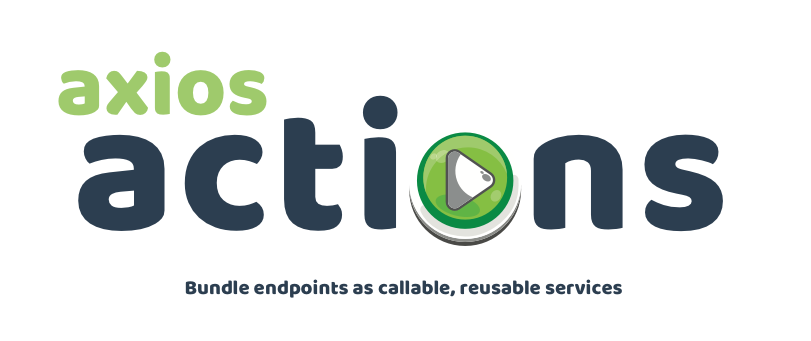

# Documentation

> Home

## 🚀 2 minute docs

Just the essentials

- [**Quick start**](quick-start.md)
   End-to-end setup on one page

## 📗 5 minute docs

A bit more background...

- [**Quick start**](quick-start.md)
   End-to-end setup on one page
- [**Tips and tricks**](tips.md)
   The best bits of the library on one page
- [**Actions config**](config.md)
   All the ways to configure endpoints
- [**ApiGroup**](classes/ApiGroup.md)
   The primary class you'll use package and call endpoints

## 📚 20 minute docs

The whole enchilada!

- **Getting started**
     Start here to understand the package

    - [**Quick start**](quick-start.md)
       End-to-end setup on one page
    - [**Tips and tricks**](tips.md)
       The best bits of the library on one page
    - [**Actions config**](config.md)
       All the ways to configure endpoints
    - [**API**](api.md)
       The full class API

- [**Classes**](classes/README.md)
     Core functionality packaged as classes

    - [**ApiCore**](classes/ApiCore.md)
       Provides base functionality for all other classes
    - [**ApiGroup**](classes/ApiGroup.md)
       Extends `ApiCore` to package URLs as callable actions
    - [**ApiEndpoint**](classes/ApiEndpoint.md)
       Extends `ApiGroup` to manage CRUD endpoints
    - [**ApiResource**](classes/ApiResource.md)
       Extends `ApiEndpoint` to more fully manage CRUD resources

- [**Extension**](extension/README.md)
     Extend Axios Actions to encapsulate logic within services

    - [**Hooks**](extension/hooks.md)
       Modify request and response data
    - [**Plugins**](extension/plugins.md)
       A simple architecture to package hooks as functions
    - [**Helpers**](extension/helpers.md)
       Helper functions to make modifying data a little easier
    - [**Classes**](extension/classes.md)
       Package all custom functionality into a new service template
